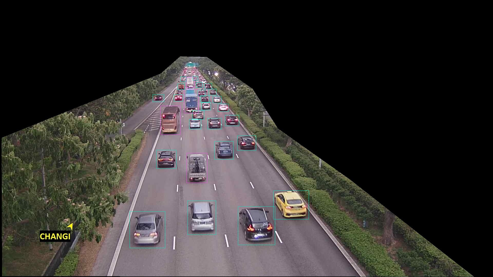

# Singapore Traffic Jam Detection Using Anomaly Detection



This project includes Python scripts for detecting traffic jams using anomaly detection on live camera feed images from the Singapore Government's Traffic API. The YOLOv11 model is employed to count the number of vehicles in each image. Anomaly detection is then performed using the z-score method on features such as the occupation ratio and the vehicle count to identify traffic surges.


## Installation

1. Clone the repository:
    ```sh
    git clone https://github.com/BlazeStorm001/singvms-anomaly.git
    cd singvms-anomaly
    ```

2. Install the required packages:
    ```sh
    pip install -r requirements.txt
    ```

## Usage

### 1. Create a polygon mask using a sample image to extract the Region of Interest (Road)
```
python mask.py --image_path "data\\3796\\raw\\3796_20241216_223631.jpg"

```

### 2. Segment ROI in all the images
```
python segment.py --input_folder "data/3796/raw" --output_folder "data/3796/masked" --points_json "points.json"

```

### 3. Run inference on segmented images and save the predictions
Obtain API key from [Roboflow](https://www.roboflow.com) and run:
```
python inference.py --masked_dir "data/3796/masked" --output_dir "data/3796/output" --json_dir "data/3796/json" --api_key "YOUR_ROBOFLOW_API_KEY"

```

### 4. Prepare the timeseries using the predictions from roboflow
```
python prepare.py --json_directory "data/3796/json" --points_json "points.json" --output_file "37962_vehicle_data.csv"

```

### 5. Detect anomalies using right tailed Z-threshold
```
python anomaly.py --file_path "3796_vehicle_data.csv" --significance_level 0.001
```
